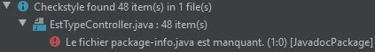
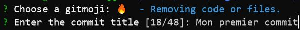
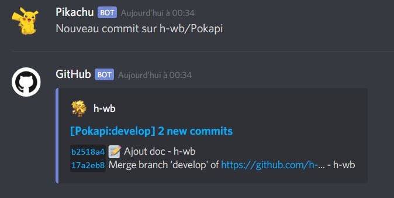
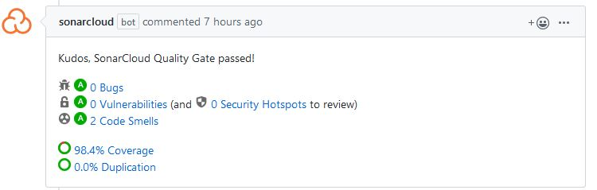
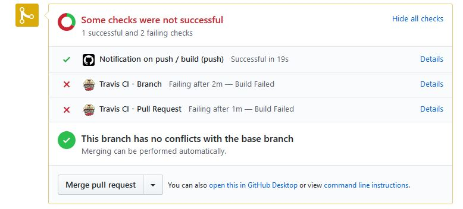
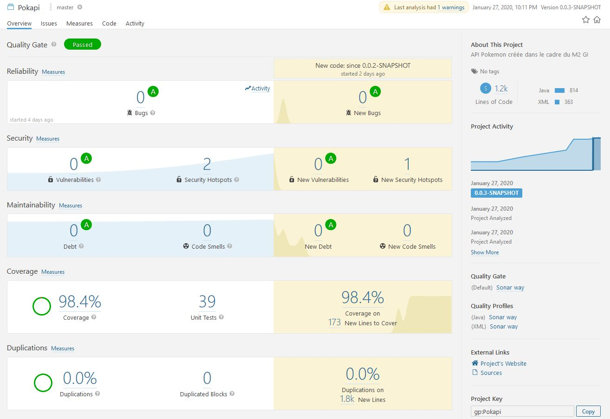
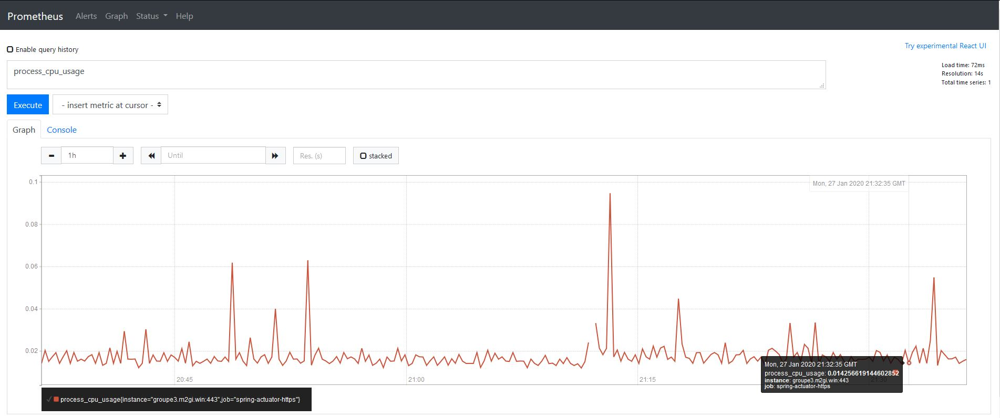
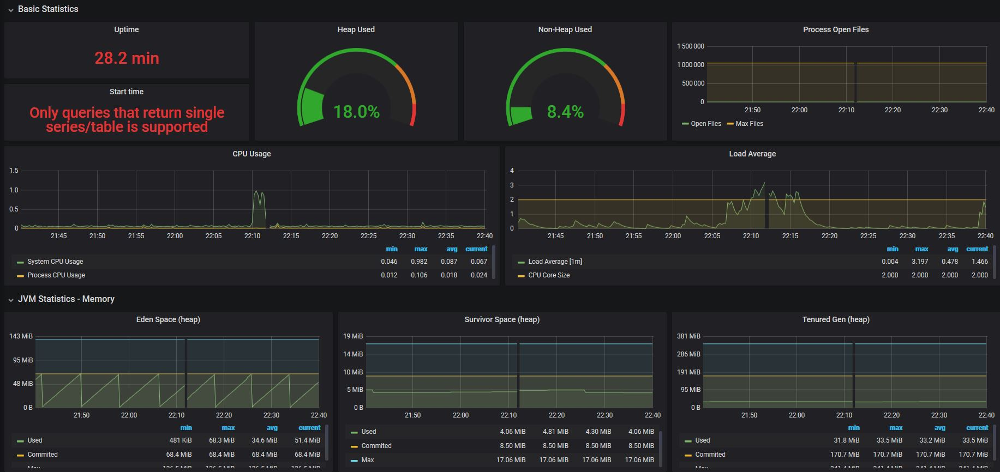

# Nouveau développeur

## Prérequis

Avant de commencer, les outils suivant sont nécessaires :

| Nom              | Version | URL                                                                                  |
|------------------|---------|--------------------------------------------------------------------------------------|
| Maven            | 3.3+    | http://maven.apache.org/download.cgi                                                 |
| JDK              | 8+      | https://www.oracle.com/technetwork/java/javase/downloads/jdk8-downloads-2133151.html |
| Git              | -       | -                                                                                    |
| Eclipse/IntelliJ | -       | https://www.jetbrains.com/idea/                                                      |
| Compte Github    | -       | -                                                                                    |
| Compte Jenkins   | -       | Fourni par les mainteneurs                                                           |

Tous les identifiants pour chacun de services que vous verrez ici sont :

| Identifiant              | Mot de passe |
|------------------|---------|
| admin            | admin    |

Cela sera amené à changer (Voir [Issue #33](https://github.com/h-wb/Pokapi/issues/33))

## Pour commencer

Clonez le dépot :

```bash
git clone https://github.com/h-wb/Pokapi.git
```

Rendez vous dans le répértoire ou le repository a été cloné puis installer le projet :

```bash
mvn clean install
```

Vous êtes désormais prêt à développer sur l'application.

## Outils complémentaires

Afin d'améliorer l'expérience de développement et la qualité du code, plusieurs plugins sont nécessaires.

- Checkstyle : permet d'indiquer les erreurs ne suivant pas le standard de codage défini. Ici la convention suivie est celle de [Sun](https://checkstyle.org/sun_style.html).

- Findbugs : permet de trouver les bugs

### IntelliJ

Rendez vous dans File > Settings > Plugins et installez les plugins.


Après l'installation, redémarrez votre IDE.

#### Checkstyle 
Pour utiliser le plugin checkstyle : Analyze > Inspect Code, les erreurs s'afficheront alors sur votre console



#### Findbugs
Pour utiliser le plugin findbugs : Analyze > FindBugs > Analyze Project Files

### Eclipse

*Prochainement*

## Lancer l'application

Pour lancer l'application on utilise :

```bash
mvn spring-boot:run
```

Ou on lance via IntelliJ ou Eclipse.

L'application sera alors disponible sur [http://localhost:8080](http://localhost:8080), la documentation swagger sur [http://localhost:8080/swagger-ui.html](http://localhost:8080/swagger-ui.html)
et Sprint Boot Admin sur [http://localhost:8080/admin](localhost:8080/admin) (voir [Spring Boot Admin](#spring-boot-admin))
## Pratique de développement

### GitFlow

**develop** est la branche principale.

Lors d'un nouveau développement, il est nécessaire d'ouvrir une branche **feature**.
Chaque nouvelle feature a sa propre branche.

Les branches terminées sont mergées dans **develop** quand elles sont prêtes.
Une **pull request** est alors ouverte, permettant une revue de code avant validation.
Une fois la **pull request** validée, la branche est mergée dans **develop** puis supprimée.

Lors d'une livraison, une branche **release** est créée depuis la branche **develop**, les corrections y seront faites.
Les versions finales sont mergées dans **master** et taguées.

Les corrections critiques sont effectuées dans la branche **hotfix**.
Elles sont mergées dans **develop** et sont mergées et taguées dans **master**.


### Vérification

Après avoir écris du code, on vérifie qu'il n'y a pas de régression :

```bash
mvn verify
```
Cette commande va vérifier que les tests fonctionnent (Dans l'absolu, cela sera vérifié par la [PIC de test](#travis) avant de pouvoir merge le code sur develop). Elle va également vérifier que le checkstyle est 
respécté, dans le cas contraire le verify fail (en 0.2.0 uniquement : Voir [Issue #26](https://github.com/h-wb/Pokapi/issues/26)).

### Commit

Pour commit, on utilisera :

```bash
git commit
```

Votre console vous demandera alors de choisir un gitmoji (suivant [cette convention](https://gitmoji.carloscuesta.me/))



Puis on pushera sur la branche correspondante (feature, hotfix, ... en respectant le [GitFlow](#gitflow))

Chaque commit sera notifié dans le channel #github du [Discord](https://discord.gg/9J8avy) pour permettre de prevenir les reviewers.



### Pull Request

Après avoir push sur votre branche, vous pourrez faire une demande du pull request. Cette pull request sera vérifiée par la [PIC de test](#travis) avec différents outils qui vous notifieront sur cette même
PR.

- Sonarqube : qui va indiquer les bugs, vulnérabilités et code smell



- Codecov : qui va indiquer la différence de coverage entre votre branche et la branche develop


Enfin, votre PR sera résumé par les checks :



Elles indiquent le résultat du build de la [PIC de test](#travis). Ici la [PIC de test](#travis) vérifie que les tests fonctionnent, dans le cas contraire elle retourne un échec.

**Si votre PR a des checks en échec, il y a très peu de change qu'elle soit merge en develop.**

### Post merge

Après votre merge, vous pouvez vérifiez que tout va bien grâce aux outils de [supervision](#supervision) de la [PIC de recette](#jenkins) et que l'application est bien déployée ([https://groupe3.m2gi.win/swagger-ui.html](https://groupe3.m2gi.win/app/swagger-ui.html))

## Documentation

La documentation actuelle est située dans le dossier docs du repository. Sa configuration est située dans .vuepress/config.js. Pour ajouter une page de documentation, on édite le fichier 
.vuepress/config.js. Le dossier api est généré automatiquement par swagger et sa documentation est créée par les annotations spring.

Example :


Elle est générée et déployée sur la branche *gh-pages* du repository automatiquement par la [PIC de test](#travis).

## PIC(s)

### Travis

Travis (**PIC de test**) lance un build de l'application à chaque nouvelle Pull Request. Il permet de vérifier que les tests fonctionnent ou non
et d'en informer le développeur. Il est également responsable du déploiement de la documentation statique.
 
 Il est utilisé car son intégration est très simple et efficace avec Github. 
 
 Son interface est disponible [ici](https://travis-ci.com/h-wb/Pokapi).

### Jenkins 

Jenkins (**PIC de recette**) lance un build de l'application à chaque nouveau commit. Il ne devrait à priori jamais avoir à lancer manuellement de job.
Cependant, si cela est nécessaire cela peut être fait via l'interface [Jenkins](https://jenkins.m2gi.win/).
- Cliquez sur le projet **Pokapi**
- Cliquez sur **Lancer un build**
- Cliquez sur le dernier build lancé (indiqué par le chiffre le plus élévé, représentant le numéro de build)
- Cliquez sur Console Output pour voir le déroulement du build

**Si le build n'est pas en succès, veuillez ouvrir une issue et indiquez l'erreur ou faites une pull request.**

## Supervision

Afin de superviser l'application après un commit sur develop, plusieurs outils sont à votre disposition :


### Sonarqube

[Sonarqube](https://sonarqube.m2gi.win/dashboard?id=gp%3APokapi) permet d'indiquer les bugs, les failles de sécurité, la dette technique et la couverture de code.
Le standard de qualité de ce projet nécessite qu'il n'y ait aucune vulnérabilité et une couverture de plus de 80%.



**Bien qu'il y ait des vérifications préalable. Si des regressions sont amenés sur l'environnement de recette, veuillez ouvrir une issue et indiquez l'erreur ou faites une pull request.**

### Prometheus

Prometheus permet de récuperer des informations de l'application spring et de la machine (*ressources utilisées, nombre de requêtes envoyées, ...*)
Son but premier est de fournir les informations à [Grafana](#grafana) qui va être notre outils de supervision principal.
Cependant, l'interface est tout de même disponible temporairement [ici](http://m2gi.win:9090/graph) (et également [ici](https://groupe3.m2gi.win/prom/new/) : voir [Issue #25](https://github.com/h-wb/Pokapi/issues/25))



**Pour vérifier que l'application spring répond bien, vérifiez son état [ici](http://m2gi.win:9090/targets)**

### Grafana

Grafana est un outil qui permet de visualiser les informations envoyées par prometheus sous forme de différent graphe. Il est l'outil le plus vital pour l'environnement de recette car
il permet d'afficher des informations importantes de façon très visuelle et indicative. Si le dernier déploiement de l'application a un impact sur les performances de l'application, Grafana sera l'indicateur principal.

Pour accéder à l'interface, rendez vous temporairement [ici](http://m2gi.win:9092) (et également [ici](https://groupe3.m2gi.win/grafana/login): voir [Issue #25](https://github.com/h-wb/Pokapi/issues/25)). Vous pouvez également accéder au dashboard utilisé
pour l'application spring [ici](http://m2gi.win:9092/d/spring_boot_21/spring-boot-2-1-statistics?orgId=1)



**Si un des indicateurs dépasse le seuil limite (généralement signalé par la couleur rouge), il est important de le signaler. Ici les informations vitales vont être le *CPU Usage*, le *Memory Allocate*, le *Response Time*, et les *Logback Statistics*. Elles determinent si l'application répond bien et s'il n'y a pas d'erreur**

### Spring Boot Admin

Spring Boot Admin permet également de récuperer les informations envoyées par prometheus. Elle est disponible [ici](https://groupe3.m2gi.win/admin).
Elle est disponible dans un contexte local ([localhost:8080/admin](localhost:8080/admin)) pour avoir des informations avant de commit du code, notamment :
- Les métriques (Aperçus > Métriques)
- Les listes de variables d'environnement (Aperçus > Environnement)
- Les propriétes de configurations (Aperçus > Propriétés de configuration)
- La priorité des logs (Loggers)


**Si l'application Spring n'est pas visible sur Spring Boot Admin, veuillez ouvrir une issue et indiquez l'erreur ou faites une pull request.**